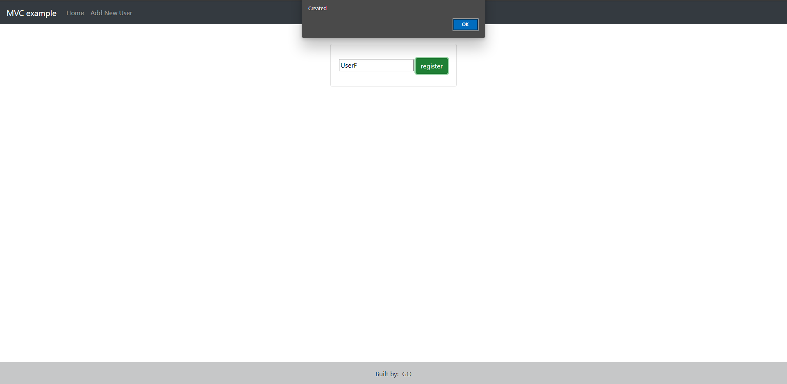
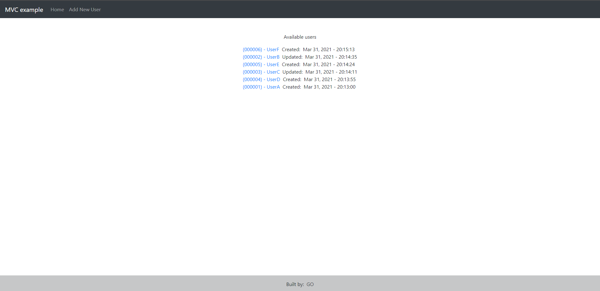
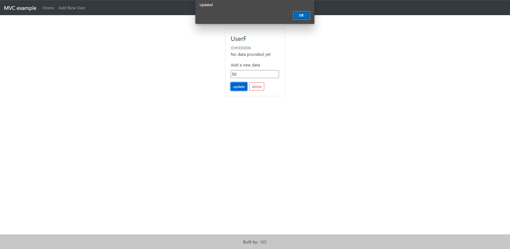
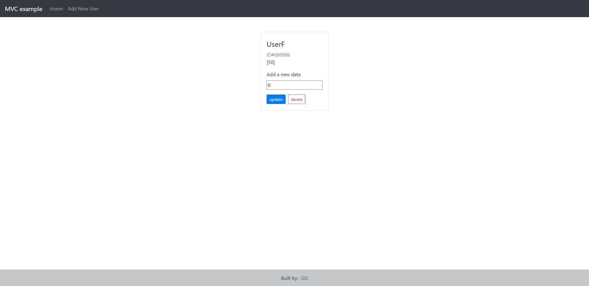
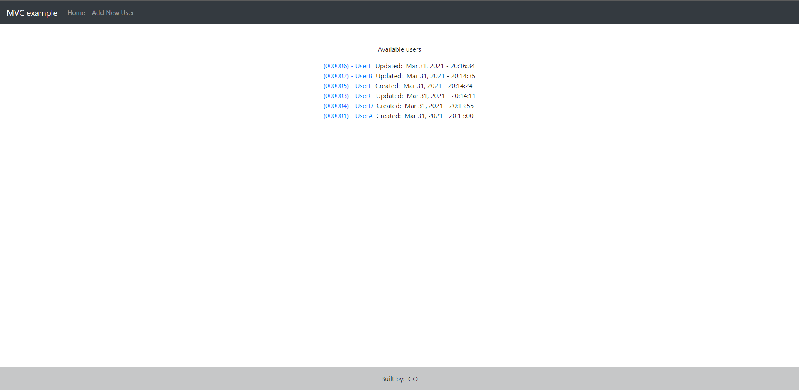
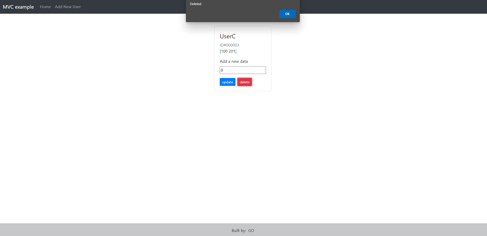
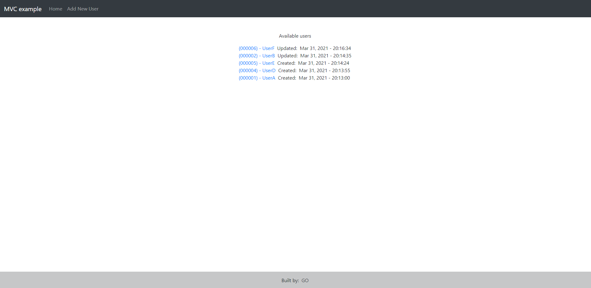

#### Four pages
- / -> Home page
- /user/create -> register a new user
- /user/:id -> show detail of the user
- /error -> when user's data not found

#### More three routes
- "POST" /user -> create a new user
- "PATCH" /user/:id -> update the user's data
- "DELETE" /user/:id -> delete the user

1) Add UserF

2) UserF just created

3) Update 50 to UserF

4) After updated

5) UserF's time changed

6) Delete UserC

7) UserC disappeared

